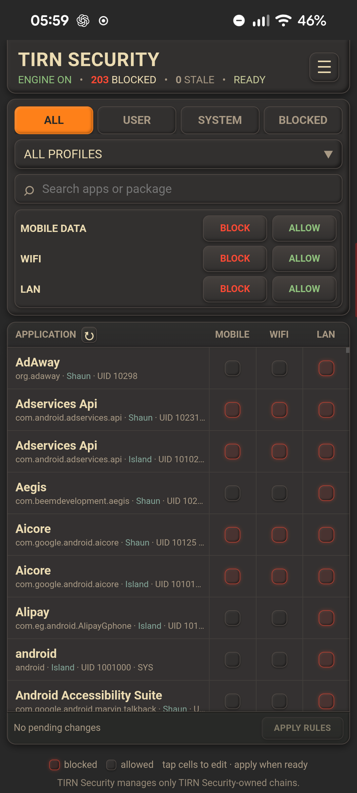

## Preview

# TIRN Security

TIRN Security is a rooted Android firewall module for controlling
network access on a per-application basis.

It provides a lightweight WebUI for managing application network
policies across **mobile data, Wi-Fi, and LAN**, with support for
multiple Android user profiles and both IPv4 and IPv6.

## Features

- Per-application network access control
- Block or allow access independently for:
  - Mobile data
  - Wi-Fi
  - LAN
- IPv4 and IPv6 support
- Multiple Android user profiles
- VPN aware network handling
- Application filtering and search
- Live policy status
- Policy backup and restore
- JSON policy export/import
- Clear all TIRN Security policies from the WebUI
- Lightweight local WebUI
- Designed for Magisk
- No dependency on KernelSU

## Requirements

- Rooted Android device
- Magisk
- Android device with working `iptables`/`ip6tables` firewall support
- A modern web browser for the WebUI

### Required Magisk Superuser settings

The following **Magisk → Superuser** settings are required:

**Multiuser mode**

- **Each user has their own separate root rules**

**Mount namespace mode**

- **Root sessions will inherit their requester's namespace**

These settings are required for TIRN Security's per-user application identity
and firewall handling to operate correctly.

TIRN Security is developed and tested on a rooted Google Pixel 8a.

## Installation

Install TIRN Security as a Magisk module using the standard Magisk
module installation process.

After installation, reboot the device if required by Magisk.

TIRN Security provides a local WebUI for managing policies.

The module's WebUI is available at:

`http://127.0.0.1:8765/index.html`

The module's Action button can also be used to open the WebUI.

The WebUI can also be installed as a Progressive Web App (PWA) from
a supported browser, providing a standalone app-like interface.

## Using TIRN Security

### Application policies

The main interface presents installed applications in a
network-policy matrix.

Each application has independent controls for:

| Network | Description |
|---|---|
| Mobile | Mobile/cellular data |
| Wi-Fi | Wi-Fi network traffic |
| LAN | Local network traffic |

Tap a network cell to change that application's policy.

Blocked and allowed states are shown directly in the application
list, making it possible to see the current policy without opening a
separate configuration screen.

### Profiles

TIRN Security supports Android's multiple-user environment.

Applications are associated with their Android user/profile,
allowing policies to be managed independently for applications
belonging to different profiles.

The WebUI provides profile selection and application filtering to
make it easier to manage applications on devices using multiple
Android users or work/profile environments.

### Application filtering

The application list can be filtered to make larger application
lists easier to manage.

Available filtering includes:

- All applications
- User applications
- System applications
- Blocked applications

Applications can also be searched directly from the WebUI.

## VPN handling

TIRN Security tracks the underlying network used by VPN
connections so that network policies continue to follow the
appropriate physical network.

This allows policies for Wi-Fi, mobile data, and LAN traffic to
remain effective when applications are using a VPN connection.

## Policy backup and restore

TIRN Security can export its current policy to a JSON backup file.

Backups contain TIRN Security policy entries only.

Each exported policy entry contains the policy information and,
when the matching application is available, application metadata:

- Application UID
- Network type
- Block action
- Application name
- Package name
- Android user/profile ID
- Profile name
- System/user app classification

The UID, network type, and action are used to identify and restore
the corresponding TIRN Security policy. The application metadata is
included to make the backup easier to read and audit.

A backup can later be imported to restore the corresponding
TIRN Security policies.

Importing a backup replaces the current TIRN Security policy state
with the policies contained in the backup.

The WebUI also provides an option to clear all TIRN Security blocks.

## How TIRN Security works

TIRN Security maintains its own firewall policy chains and uses them to
apply application-specific network policies.

The firewall is organized around a TIRN Security dispatcher and
generation-based policy chains rather than directly modifying unrelated
Android firewall rules.

Application policies are applied using the application's Android UID.

Network state is tracked separately from application state. When the
effective network configuration has not changed, TIRN Security does not
create another firewall transaction unnecessarily.

Application package broadcasts are treated as events that trigger
application-state processing. The authoritative application snapshot
remains the source of application identity.

Application changes are compared using:

`user | package | UID`

An event that does not produce an effective identity change does not
require an unnecessary firewall generation.

When an effective policy change is required, TIRN Security prepares a new
firewall generation, verifies it before activation, and then atomically
switches the active generation.

This keeps policy changes isolated from unrelated Android firewall
configuration while avoiding unnecessary firewall rebuilds.

## Boot and state convergence

TIRN Security is designed to converge safely after boot and network
changes.

For an existing installation, the previous valid application state can
be used to establish the initial firewall state before the authoritative
application refresh completes.

The refreshed application state is then compared with the previous
identity snapshot. A second firewall generation is only required when
the effective application identity or policy state has actually changed.

Network state is handled independently and is deduplicated against the
persisted network state.

This prevents unchanged application or network state from causing
unnecessary firewall transactions.

## Policy transaction safety

Policy changes are handled through an authoritative transaction path.

The same authoritative transaction path is used for:

- Individual policy changes
- Bulk policy changes
- Clear-all
- Policy import
- Stale application reconciliation

A candidate policy is validated before activation.

The firewall generation is built and verified before it becomes active.
Persistent policy state is also verified as part of the transaction.

If a transaction cannot be completed safely, the existing valid state is
retained or restored rather than leaving a partially applied policy
active.

The design is intended to preserve fail-closed behavior during
unsuccessful or interrupted transactions.

## Application identity and stale policies

TIRN Security maintains an authoritative application identity snapshot
in addition to the application metadata displayed by the WebUI.

Application identity is based on the Android user/profile, package name,
and UID.

This allows application additions, removals, updates, replacements, and
UID changes to be distinguished from events that do not actually change
the effective application identity.

If an existing policy becomes associated with a missing application or a
changed UID, it can be identified as stale rather than silently
reassigned to another application identity.

Stale policies can then be reviewed and reconciled through the WebUI.

## Firewall scope and safety

TIRN Security is designed to operate only on firewall chains owned
by TIRN Security.

**TIRN Security does not flush, delete, or modify unrelated/native
Android firewall chains or rules.**

The WebUI manages TIRN Security policy state rather than directly
manipulating the device's native firewall configuration.

Policy backup, import, clear operations, application events, and
network changes all converge through TIRN Security's policy and firewall
transaction mechanisms.

This separation is an important part of TIRN Security's design.

## WebUI

The WebUI uses a dark Gruvbox inspired interface with raised,
embossed card styling and clear visual separation between application
controls and larger policy-management elements.

The interface is designed around the application policy matrix rather
than a collection of complex configuration pages.

The main interface provides:

- Application list
- Network policy controls
- Profile selection
- Application filtering
- Search by application name or package
- Policy status and blocked-rule count
- Backup and restore controls
- Clear-policy controls

The WebUI communicates with TIRN Security through its local CGI interface.

## Performance and resource usage

TIRN Security's application, network, policy, and firewall processing has
been optimized to avoid unnecessary repeated work.

The implementation uses:

- Incremental application processing where possible
- Coalesced package-event handling
- Authoritative application identity comparison
- Network-state deduplication
- Atomic policy transactions
- Generation verification before activation
- APK label caching
- Removal of redundant refresh and generation paths
- Cleanup of obsolete generated state

Performance validation has included application refresh time, firewall
generation activity, event processing, idle CPU usage, memory/process
usage, and practical resource impact.

The optimization work prioritizes eliminating unnecessary processing
while preserving the safety and atomicity of the firewall architecture.

## Troubleshooting

### The WebUI does not load

Check that the TIRN Security module is enabled in Magisk and that
the TIRN Security WebUI server is running.

The WebUI is served locally on:

`127.0.0.1:8765`

Try opening:

`http://127.0.0.1:8765/`

If the root address does not open, try:

`http://127.0.0.1:8765/index.html`

### An application does not appear

Refresh the WebUI and check the selected Android profile and
application filter.

Applications belonging to another Android user/profile may not
appear when a different profile is selected.

### A policy does not appear immediately

TIRN Security refreshes policy state through the WebUI API.

The WebUI also polls for policy changes while it is visible.
Refreshing the page forces the interface to reload the current policy
state.

### Network behaviour changes after switching networks

TIRN Security maintains a network dispatcher so that policies can
follow changes between Wi-Fi, mobile data, LAN, and VPN underlying
networks.

If a network transition appears to leave an application in the
wrong state, first refresh the WebUI and verify the current policy.

## Alpha Testing and Feedback

TIRN Security 1.0.0 is an alpha release intended for testing and feedback.

Please report bugs and technical issues through the project's **GitHub
Issues**.

When reporting an issue, include as much of the following information as
possible:

- TIRN Security version
- Android version
- Device model
- Magisk version
- Steps to reproduce the problem
- Expected behaviour
- Actual behaviour
- Relevant TIRN Security logs
- Screenshots where applicable
- The affected application, Android user/profile, and network type where
  relevant

For firewall or policy issues, include the policy configuration and
network conditions involved where possible.

GitHub Issues are the authoritative record for alpha-test bugs and
technical issues.

## Development

TIRN Security is developed as a Magisk module with its firewall
engine, network dispatcher, policy storage, application metadata
helper, and WebUI maintained as separate components.

The WebUI is served locally by the module and communicates with
TIRN Security through CGI endpoints.

The project is developed and tested on-device using a rooted Pixel
8a and Linux development environment.

## Project principles

TIRN Security follows these core principles:

1. **Application-level control**

   Policies are associated with Android application UIDs rather than
   broad system-wide rules.

2. **Network-specific policies**

   Mobile, Wi-Fi, and LAN access can be controlled independently.

3. **IPv4 and IPv6 parity**

   Policies are applied consistently across both IP versions.

4. **Profile awareness**

   Android user/profile separation is preserved.

5. **Minimal firewall scope**

   TIRN Security operates only on its own firewall chains.

6. **Atomic policy changes**

   Firewall generations are built and verified before activation.

7. **Fail-closed behavior**

   Unsafe or incomplete firewall transactions do not intentionally
   replace a known valid state with a partially applied policy.

8. **Authoritative application state**

   Application identity is determined from the authoritative application
   snapshot rather than relying solely on package-event notifications.

9. **Measured optimization**

   Performance improvements are based on measured reductions in
   unnecessary processing rather than added complexity without a
   demonstrated benefit.

10. **Simple management**

   The WebUI provides a straightforward way to inspect and change
   policies without requiring command-line interaction.

## Donations

If you find TIRN Security useful and would like to support its
development, donations are appreciated but entirely optional.

### PEP

`PvYk6mcQ2HBGNXGkEi7TDKHNAK1skNzj7K`

### Bitcoin (BTC)

`bc1qf2ccj00zgfk0y5s6xmykvq89qq5a4e5ulweyun`

### Stellar (XLM)

`GDPCFLZE3UPXXQLZITWZZA67MRY35S4T223HLEOQGAKG7IKLX5F5ZM4I`

Thank you for supporting the project.

## License

See the repository license for the terms under which TIRN Security
is distributed.
